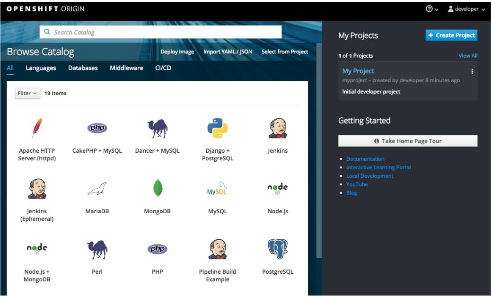

Once the Minishift cluster is up, open your favorite web browser and open OpenShift, using the URL given from the output of the minishift start command. It is accessible via **DashBoard**, in our case:

OpenShift login page

Use the developer user, with any password, to log in on the welcome page:

OpenShift welcome page

Click on My Project to access the OpenShift Project Overview page. From there, click on the Builds | Pipelines sub-menu:

From here, you should be able to click on Create Sample Pipeline. Then, scroll all the way down and click on the Create button. It should tell you that the Pipeline Build Example has been created:

OpenShift creates a set of pods including Jenkins, mongodb and nodejs, with further integration with OpenShift. And all of that with just one click. This is just a demo, but isn't that cool? Now go back to the Overview menu to check the overall progress:

OpenShift project menu

You should be able to see a few applications, with pods. The first one is a Jenkins application, and the second one is MongoDB, as a part of our test application. There should be No deployments for nodejs-mongodb-example, because it will be controlled by Jenkins pipelines.

Note
Depending on your internet connection, it will take time to pull all of the images and start all of the pods, especially for Jenkins, as it is roughly 2.5 GB. You can go to the Monitoring tab and click on View details to check the current status of the overall process. If the last message from Jenkins is pulling image openshift/jenkins-2-centos7, then just wait patiently, or go and make some coffee.
